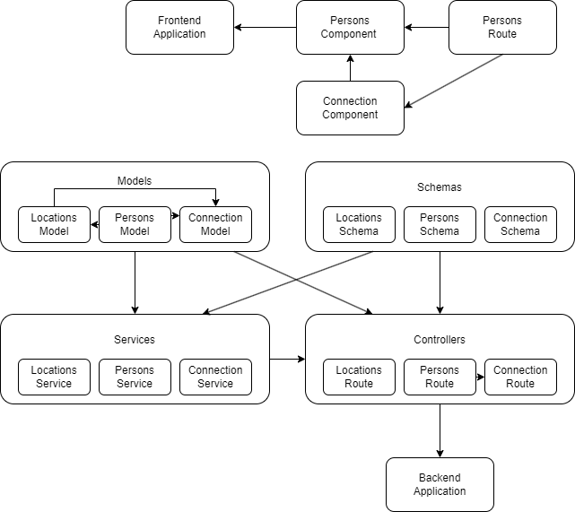

# Strategy

There are three services in initial app.
- database (postgres)
- bakend (udaconnect-api)
- frontend (udaconnect-app)

NAME             TYPE        CLUSTER-IP      EXTERNAL-IP   PORT(S)          AGE
kubernetes       ClusterIP   10.43.0.1       <none>        443/TCP          12m
postgres         NodePort    10.43.210.191   <none>        5432:30850/TCP   84s
udaconnect-api   NodePort    10.43.192.216   <none>        5000:30001/TCP   84s
udaconnect-app   NodePort    10.43.27.184    <none>        3000:30000/TCP   84s

The dependancy graph:

- It's no need to divide frontend on services, because it is only one rote used and two components, which are connected the route.

- On the backend side I see three clear parts which can be divided on services (Locations, Persons and Connection).
We Will start with the Location first, because there are less connections with other components.

- As I see, for the route "/locations" the code is missing. It should be fixed.

-----------------------------------------------------------------------------------------------

Image API changed:
> docker build -t api modules\api
> docker images

REPOSITORY                                             TAG       IMAGE ID       CREATED              SIZE
api                                                    latest    29b29e8db98a   About a minute ago   547MB

> docker image tag api:latest elenakutanov/api:latest
> docker push elenakutanov/api:latest