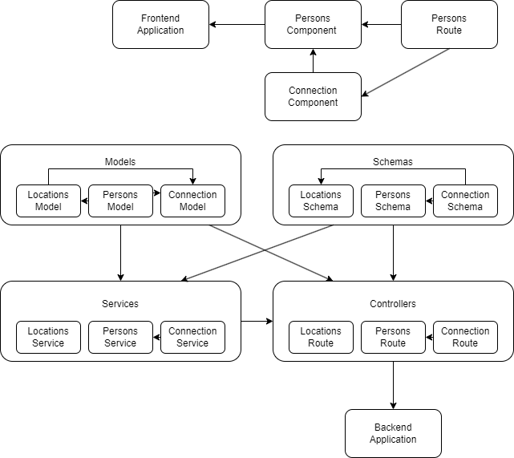

# Strategy

There are three services in initial app.
- database (postgres)
- bakend (udaconnect-api)
- frontend (udaconnect-app)

NAME             TYPE        CLUSTER-IP      EXTERNAL-IP   PORT(S)          AGE
kubernetes       ClusterIP   10.43.0.1       <none>        443/TCP          12m
postgres         NodePort    10.43.210.191   <none>        5432:30850/TCP   84s
udaconnect-api   NodePort    10.43.192.216   <none>        5000:30001/TCP   84s
udaconnect-app   NodePort    10.43.27.184    <none>        3000:30000/TCP   84s

The dependancy graph:

- It's no need to divide frontend on services, because it is only one rote used and two components, which are connected the route.

- On the backend side I see three clear parts which can be divided on services (Locations, Persons and Connection).
We will start with the Location first, because it has logic that is much less tied to other parts of the API monolith.

- As I see, for the route "/locations" the code is missing. It should be fixed.

- For intern exchange between connection and persons microservices, was choosed gRPC

-----------------------------------------------------------------------------------------------
> vagrant up
> vagrant ssh
> sudo cat /etc/rancher/k3s/k3s.yaml
copy paste in C:\Users\elena\.kube\config
> exit
> kubectl describe services
> kubectl apply -f deployment/
> kubectl get pods
> sh scripts/run_db_command.sh <POD_NAME>

> docker rmi udaconnect-app
> docker rmi elenakutanov/udaconnect-app

> docker rmi udaconnect-locations-api
> docker rmi elenakutanov/udaconnect-locations-api

> docker rmi udaconnect-persons-api
> docker rmi elenakutanov/udaconnect-persons-api

> docker rmi udaconnect-connection-api
> docker rmi elenakutanov/udaconnect-connection-api
> docker images

Image API changed:

> docker build -t udaconnect-app modules/frontend

> cd modules
> docker build -t udaconnect-locations-api -f locations_api/Dockerfile .
> docker build -t udaconnect-persons-api -f persons_api/Dockerfile .
> docker build -t udaconnect-connection-api -f connection_api/Dockerfile .

> docker images

REPOSITORY                               TAG       IMAGE ID       CREATED         SIZE
elenakutanov/udaconnect-app              latest    0d7dafa39ac9   5 minutes ago   551MB
udaconnect-app                           latest    0d7dafa39ac9   5 minutes ago   551MB
udaconnect-connection-api                latest    6272eb584bf5   21 hours ago    547MB
elenakutanov/udaconnect-connection-api   latest    6272eb584bf5   21 hours ago    547MB
elenakutanov/udaconnect-persons-api      latest    2dfcf333dc3d   21 hours ago    547MB
udaconnect-persons-api                   latest    2dfcf333dc3d   21 hours ago    547MB
elenakutanov/udaconnect-locations-api    latest    74b059ee834f   21 hours ago    547MB
udaconnect-locations-api                 latest    74b059ee834f   21 hours ago    547MB

> docker image tag udaconnect-app:latest elenakutanov/udaconnect-app:latest
> docker push elenakutanov/udaconnect-app:latest

> docker image tag udaconnect-api:latest elenakutanov/udaconnect-api:latest
> docker push elenakutanov/udaconnect-api:latest

> docker image tag udaconnect-locations-api:latest elenakutanov/udaconnect-locations-api:latest
> docker push elenakutanov/udaconnect-locations-api:latest

> docker image tag udaconnect-persons-api:latest elenakutanov/udaconnect-persons-api:latest
> docker push elenakutanov/udaconnect-persons-api:latest

> docker image tag udaconnect-connection-api:latest elenakutanov/udaconnect-connection-api:latest
> docker push elenakutanov/udaconnect-connection-api:latest

> kubectl delete deployment udaconnect-app
> kubectl delete services udaconnect-app

> kubectl delete deployment udaconnect-locations-api
> kubectl delete services udaconnect-locations-api

> kubectl delete deployment udaconnect-persons-api
> kubectl delete services udaconnect-persons-apic

> kubectl delete deployment udaconnect-connection-api
> kubectl delete services udaconnect-connection-api

> cd ..
> kubectl apply -f deployment/
> kubectl get pods

# gRPC

> python -m grpc_tools.protoc -I./ --python_out=./ --grpc_python_out=./ person.proto

